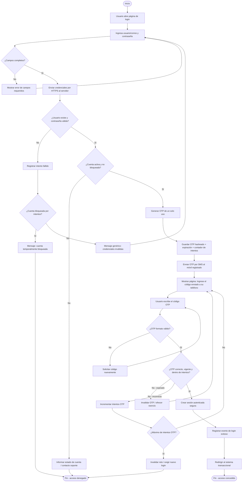
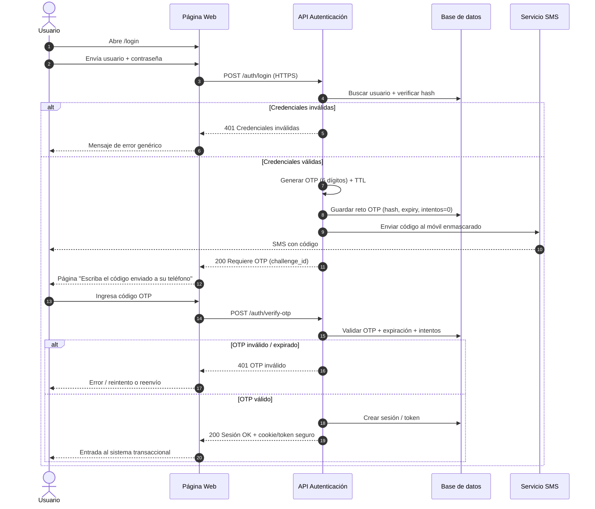

# Diagrama: entrada y validación de usuario al sistema transaccional

**Puntos rúbrica:** 25  
**Alcance:** proceso desde el acceso hasta la sesión autenticada, incluyendo **login + contraseña** y la **página de verificación del código OTP** enviado al teléfono móvil.

---

## 1. Descripción del proceso

El sistema transaccional no otorga acceso completo solo con usuario y contraseña. El flujo es de **autenticación en dos pasos (2FA)**:

1. El usuario ingresa **identificador** y **contraseña**.
2. El servidor valida las credenciales según la política de contraseñas y el hash almacenado.
3. Si son correctas, se genera y envía un **código OTP** al teléfono móvil registrado.
4. Se muestra una **página intermedia** que solicita escribir el código recibido.
5. Solo si el OTP es válido (y no ha expirado / no superó intentos), se crea la **sesión transaccional**.

---

## 2. Actores y componentes

| Elemento | Rol |
|----------|-----|
| Usuario | Persona que inicia sesión |
| Navegador / App web | Interfaz: login y página OTP |
| API de autenticación | Valida credenciales, emite retos OTP, crea sesión |
| Servicio SMS / OTP | Envía el código al móvil |
| Base de datos | Usuarios, hash de contraseña, teléfono, intentos, tokens |
| Política de contraseñas | Reglas del [manual de validación](MANUAL-VALIDACION-CONTRASENAS.md) |

---

## 3. Diagrama de flujo principal (Mermaid)

> Copia este bloque en [https://mermaid.live](https://mermaid.live) para exportar PNG/SVG, o súbelo a GitHub (renderiza automáticamente en el README/Markdown).



---

## 4. Diagrama de secuencia (login + OTP)



---

## 5. Página intermedia de OTP (requisito de la rúbrica)

Tras un login correcto, el usuario **no** entra aún al módulo transaccional. Ve una pantalla dedicada, por ejemplo:

```text
┌──────────────────────────────────────────────┐
│           Verificación en dos pasos          │
│                                              │
│  Enviamos un código a tu teléfono            │
│  terminado en ******78                       │
│                                              │
│  Código:  [ _ _ _ _ _ _ ]                    │
│                                              │
│  [ Verificar ]     [ Reenviar código ]       │
│                                              │
│  El código expira en 5 minutos               │
└──────────────────────────────────────────────┘
```

Elementos mínimos de seguridad en esa página:

- Enmascarar el número (`******78`)
- Límite de intentos y tiempo de vida (TTL) del OTP
- Opción de reenvío con cooldown (ej. 60 s)
- No revelar si el teléfono “existe” más de lo necesario
- Canal HTTPS; OTP almacenado hasheado, no en texto plano

---

## 6. Controles de seguridad del proceso

| Control | Descripción |
|---------|-------------|
| Transporte TLS | Credenciales y OTP solo por HTTPS |
| Contraseña robusta | Según [manual](MANUAL-VALIDACION-CONTRASENAS.md) |
| Hash de contraseña | Argon2id / bcrypt |
| OTP de un solo uso | Caduca; se invalida al usarse |
| Rate limiting | Límite de intentos de login y de OTP |
| Mensajes genéricos | Evitar enumeración de usuarios |
| Sesión segura | Cookie `HttpOnly`, `Secure`, `SameSite` o token con expiración |
| Auditoría | Logs de éxitos/fallos sin secretos |

---

## 7. Cómo entregar este diagrama (sugerencia)

1. Exporta ambos diagramas Mermaid a **PNG** desde [mermaid.live](https://mermaid.live).
2. Incluye las imágenes en tu informe PDF o en `docs/evidencias/`.
3. Sube este archivo `.md` a GitHub: al abrir el archivo se verán los diagramas renderizados — **toma captura** de esa vista como evidencia.
4. En la memoria escrita, agrega 1–2 párrafos explicando que después de login/password aparece la página del código SMS (sección 5).

---

## 8. Leyenda rápida del flujo feliz

```text
Login → Validar contraseña → Enviar OTP al móvil → Página OTP → Validar código → Sesión transaccional
```
